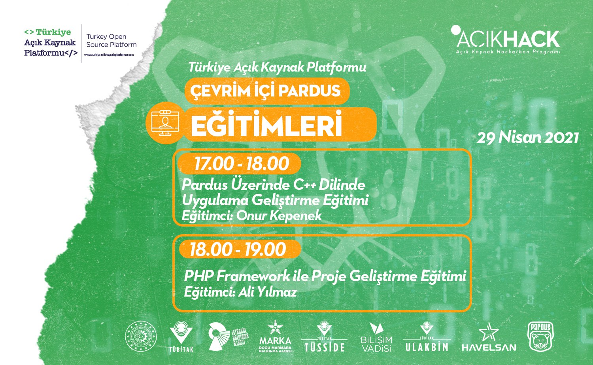

# AcikHack21MindFramework
Bu dizin, 29.04.2021 tarihinde saat 18:00-19:00 arasında Discord'ta, "Türkiye Açık Kaynak Platformu" moderatörlüğünde gerçekleştirilen etkinlikte kullanılan dosyaları barındırmaktadır.

---

## Sürüm Notları

### 1.0.0

* **0** dizini altında, rotaların kullanımına dair kapsamlı örnekler bulunur.
* **auth** dizini altında, basit üyelik sistemi ihtiyacını karşılamak için oluşturulmuş bir proje bulunur. Bu proje büyüyebilen bir yapıda olup, Tasarım deseni ve Middleware gibi çeşitli konuların pekiştirilmesini de amaçlamaktadır.
* **PhoneBook** dizini altında, bir telefon rehberi uygulaması örneği bulunur, bu uygulama ile öncelikli olarak silme, ekleme, güncelleme, arama ve sayfalama metotlarının kavranması amaçlanmaktadır.

---

### 1.0.1

* **SonDakikalardakiOrnekler** dizini altında, get_contents, coordinatesMaker, is_distance ve is_blood metodlarının örnekleri bulunur. Bu proje, aşağıdaki kazanımların edinimini amaçlamaktadır.

    * [get_contents()](https://github.com/aliyilmaz/Mind/blob/master/docs/tr-readme.md#get_contents) metodu yardımıyla belirtilen adresin kaynak kodlarından veri ayıklamak.
    * [coordinatesMaker()](https://github.com/aliyilmaz/Mind/blob/master/docs/tr-readme.md#coordinatesmaker) metodu yardımıyla sayfayı görüntüleyen kullanıcının koordinatını almak.
    * [is_distance()](https://github.com/aliyilmaz/Mind/blob/master/docs/tr-readme.md#is_distance) metodu yardımıyla iki farklı koordinat noktası arasının, belirtilen menzilde olup olmadığını kontrol etmek.
    * [is_blood()](https://github.com/aliyilmaz/Mind/blob/master/docs/tr-readme.md#is_blood) metodu yardımıyla bir parametrenin geçerli bir kan grubu olup olmadığını ya da başka bir kan grubu için donör olup olmadığını kontrol etmek.

---

## Etkinlik videosu: 
https://youtu.be/4FLe9YHoTTI?t=3761

## Etkinlik afişi

## Lisans
Bu dizinde bulunan proje dosyaları **GPL3** lisansı altında paylaşılmıştır. Youtube videosu, Etkinlik afişi, Moderatörlük gibi etkinlik organizasyonuyla ilgili katkılar **"Türkiye Açık Kaynak Platformu"** tarafından gerçekleştirilmiştir.

> Copyright (C) 2021, Ali Yılmaz and contributors 
> 
> This program is free software: you can redistribute it and/or modify
> it under the terms of the GNU General Public License as published by
> the Free Software Foundation, either version 3 of the License, or
> (at your option) any later version.
> 
> This program is distributed in the hope that it will be useful,
> but WITHOUT ANY WARRANTY; without even the implied warranty of
> MERCHANTABILITY or FITNESS FOR A PARTICULAR PURPOSE.  See the
> GNU General Public License for more details.
> 
> You should have received a copy of the GNU General Public License
> along with this program.  If not, see <https://www.gnu.org/licenses/>.

---

## Teşekkür
Katılımcılara, Türkiye Açık Kaynak Platformuna ve diğer katkıcılara teşekkürler.
